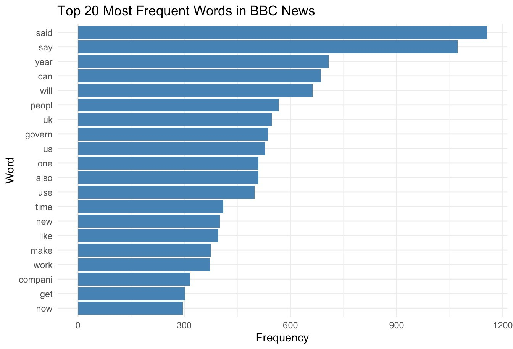
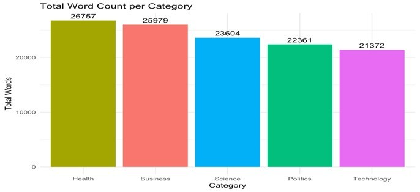
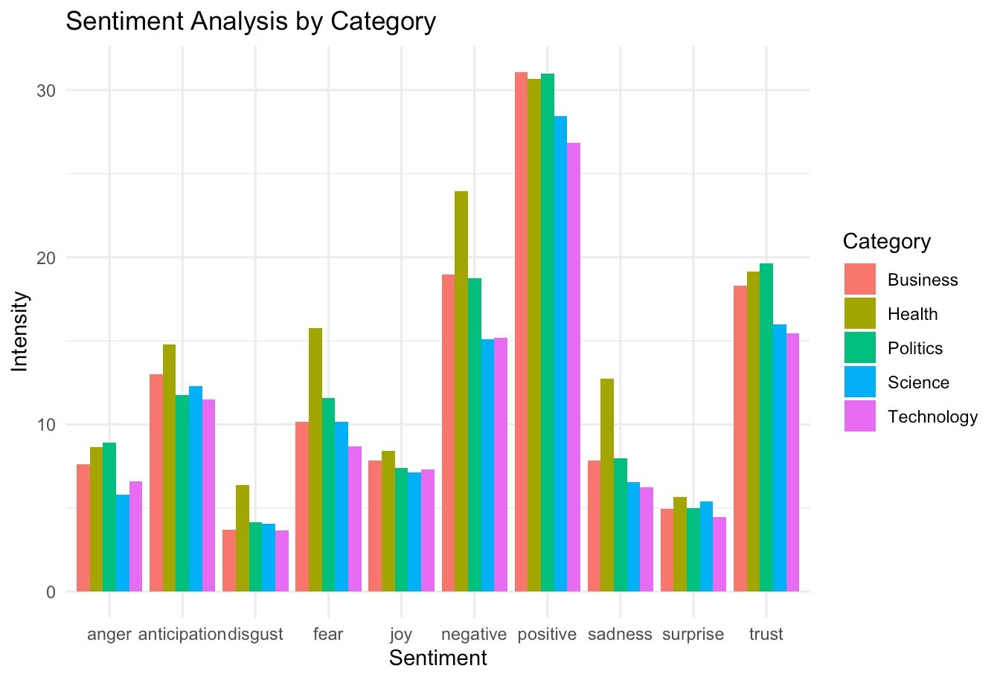
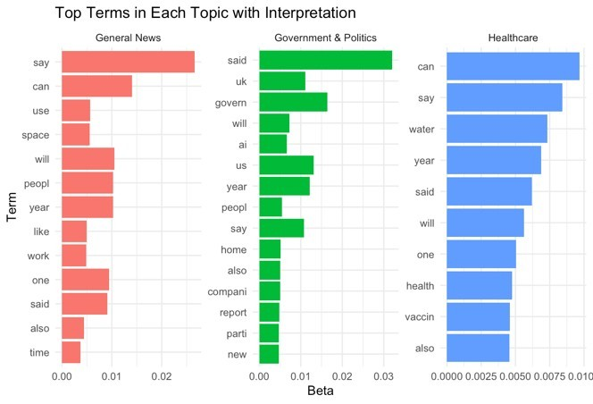

# Data Science Projects — AIUB (IDS Course)

Two end-to-end data science projects built in R, covering the full pipeline from raw data to insights.

---

## 📊 Mid-Term: Titanic Survival Analysis

**Goal:** Predict and understand survival patterns from the Titanic dataset.

**Pipeline:**
- Data cleaning: missing value imputation (median-by-group for Age, class-based median for Fare), outlier winsorization via IQR.
- Feature engineering: `AgeGroup`, `Title` (extracted from names), `IsAlone`, `FamilySize`, `FarePerPerson`.
- Encoding: one-hot encoding for Sex and Embarked, z-score normalization for continuous features.
- Visualizations: survival heatmaps by Pclass × AgeGroup, density plots, correlation matrix, pie charts.

**Dataset:** Titanic (train + test merged, ~1300 records)  
**Tools:** R, tidyverse, ggplot2, ggcorrplot, GGally, fastDummies

---

## 📰 Final: BBC News NLP Pipeline

**Goal:** Scrape, clean, and analyze BBC News articles across 5 categories using NLP.

**Pipeline & Implementation:**
- Web scraping via RSS feeds (Business, Technology, Science, Health, Politics — 50 articles each, 250 total).
- Text preprocessing: HTML stripping, lowercasing, stopword removal, stemming (SnowballC). Processed a total of 120,073 words, reducing down to 555 unique root words.
- Analysis: Word frequency, TF-IDF, Sentiment scoring (syuzhet/NRC), Topic modeling (LDA via topicmodels).
- Named Entity Recognition (NER): Built an enhanced regex pipeline to extract Persons, Locations, Organizations, Dates, and Money.

**Key Findings:**
- **Category Density:** The Health category generated the highest volume of text (26,757 words), followed by Business.
- **Sentiment Analysis:** Health yielded the highest average positive sentiment score (11.4), while Technology yielded the lowest (7.98).
- **Topic Modeling (LDA):** Successfully clustered the corpus into 5 distinct interpretative topics: Gaming & Entertainment, Finance & Economy, Healthcare, Government & Politics, and Technology & Security.

### Visualizations & Results

  
  

  
  

**Dataset:** 250 BBC News articles (`bbc_news_final.csv`)  
**Tools:** R, tidytext, tm, topicmodels, syuzhet, wordcloud, ggplot2, rvest

---

## 🗂 Structure
├── Mid/
│   ├── G01-mid-project.r         # Full analysis script
│   ├── titanic.csv               # Combined dataset
│   └── G01-mid-project-report.pdf
├── Final/
│   ├── G01 final-project(Text Mining).R    # BBC scraper
│   ├── G01 final-project (NLP Tecniq).R    # NLP analysis
│   ├── bbc_news_final.csv                  # Scraped dataset
│   ├── G01 final_project report 1.pdf
│   └── images/                             # Output visualizations
